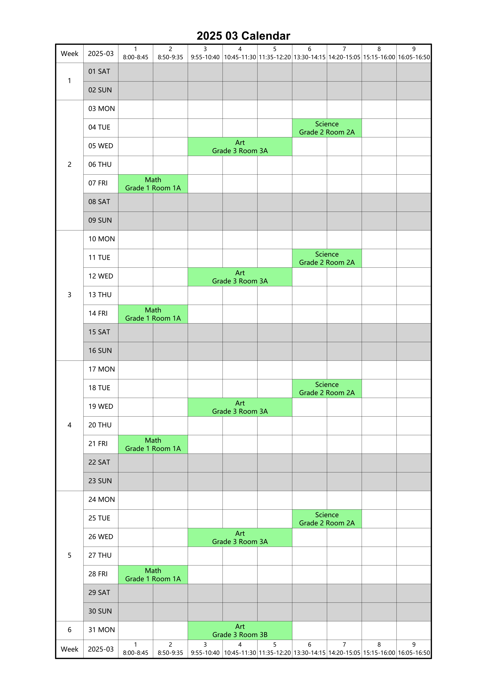

# Calendar_generator
This Python script generates a monthly semester calendar in PDF format, displaying class schedules, lesson times, and with weekends highlighted.
The calendar is customizable and supports English and other language text, such as Chinese language.

## Screenshot

Below is a screenshot of the generated PDF (`calendar_2025_03.pdf`):



---

## Features

- **Customizable Calendar**: Generate a calendar for any month and year.
- **Class Schedule Integration**: Populate the calendar with class schedules from a JSON file.
- **Highlight Weekends**: Saturdays and Sundays are highlighted for better visibility.
- **Multi-Language Support**: Supports English and other language text.
- **PDF Output**: Generates a clean and printable PDF file.

---

## Requirements

- Python 3.x
- `reportlab` library (for PDF generation)
- A JSON file containing class schedule data (e.g., `class-of-semester-2024-2025-2.json`)

---

## Installation

1. **Clone the Repository**:
   ```bash
   git clone https://github.com/asmearrior/calendar_generator.git
   cd calendar_generator
   ```

2. **Install Dependencies**:
   Install the required Python libraries using `pip`:
   ```bash
   pip install reportlab
   ```

3. **Prepare Class Schedule Data**:
   - Create a JSON file (e.g., `class-of-semester-2024-2025-2.json`) with your class schedule data.
   - The JSON file should follow the structure defined in the script.
The script expects a JSON file with the following structure:

```json
{
    "semester_start_day": "2025-02-24",
    "lessons": [
        {
            "name": "Math",
            "student": "Grade 1",
            "week_day": [
                {
                    "week": "1-5,6-8,11-17",
                    "day": "5",
                    "lesson": "1,2",
                    "room": "Room 1A"
                },
                {
                    "week": "17",
                    "day": "3",
                    "lesson": "1,2",
                    "room": "Room 1B"
                }
            ]
        }
    ]
}
```
### JSON Structure Description

1. **`semester_start_day`**:
   - The start date of the semester in `YYYY-MM-DD` format.
   - Example: `"2025-02-24"` means the semester starts on February 24, 2025.

2. **`lessons`**:
   - A list of classes or lessons to be scheduled in the calendar.
   - Each lesson has the following fields:
     - **`name`**: The name of the class (e.g., `"Math"`).
     - **`student`**: The group or grade attending the class (e.g., `"Grade 1"`).
     - **`week_day`**: A list of scheduling details for the class, including:
       - **`week`**: The weeks during which the class occurs. Can be a single week, a range of weeks, or a combination (e.g., `"1-5,6-8,11-17"`).
       - **`day`**: The day of the week (1 = Monday, 2 = Tuesday, ..., 7 = Sunday).
       - **`lesson`**: The lesson periods (e.g., `"1,2"` for periods 1 and 2).
       - **`room`**: The room where the class is held (e.g., `"Room 1A"`).

### Example Explanation

- The semester starts on **February 24, 2025**.
- There is one class named **Math** for **Grade 1**.
- The class occurs:
  - On **Fridays (day 5)** during weeks **1-5, 6-8, and 11-17**, in **Room 1A**, during periods **1 and 2**.
  - On **Wednesdays (day 3)** during week **17**, in **Room 1B**, during periods **1 and 2**.

---


## Usage

Run the script with the following command:

```bash
python calendar_generator.py [month] [year]
```

- **Arguments**:
  - `month` (optional): The month for which to generate the calendar (default: current month).
  - `year` (optional): The year for which to generate the calendar (default: current year).

### Example

To generate a calendar for March 2025:
```bash
python calendar_generator.py 3 2025
```

This will generate a PDF file named `calendar_2025_03.pdf`.

---

## Customization

- **Fonts**: You can change the font by modifying the `pdfmetrics.registerFont` section in the script.
- **Column Widths**: Adjust the `col_widths` variable to change the width of table columns.
- **Row Heights**: Modify the `row_heights` variable to adjust the height of table rows.

---

## License

This project is licensed under the MIT License. See the [LICENSE](LICENSE) file for details.

---

## Contributing

Contributions are welcome! Please open an issue or submit a pull request for any improvements or bug fixes.

---

## Author

asmwarrior


